# Fullstack MicroSaaS: Hosting Notes

<!-- time check: 12:06am -->

Alright, it's [been a while](https://github.com/focusOtter/appsync-cdk-full-backend-with-hosting-amplify/tree/main/lib) since I've done this, and needless to say I've gotten better and doing this stuff.

The goal here is to create and deploy a single AWS Amplify project to our `dev` environment. This means our `prod` envioronment (deployed in another region), will contain a completely different AWS Amplify project since Amplify Hosting is a regional service.

I actually like this approach because our `dev` project can be deployed close to me, while my `prod` environment can be deployed closer to my users.

My assumption here is that this will be easier than my previous repo.

## Resource Setup

To get started, in `backend/lib/app` I create `hosting/amplify.ts`. Taking a moment to review my [previous example](https://github.com/focusOtter/appsync-cdk-full-backend-with-hosting-amplify/blob/main/lib/NextjsHostingStack.ts) I should be able to refactor it easily.

I start by copying the entire file over. The goal here is to end up with a `createAmplifyHosting` function that I can call in my `lib/stack.ts` file.

Once copied, it looks like I have to install the (alpha) L2 construct for Amplify.

```sh
# while in my backend directory
npm i @aws-cdk/aws-amplify-alpha
```

So far so good. No weird version issues.

Next up is to create remove any hardcoded strings in favor of `context` values.

Hmm...doing this seems premature. I'm gonna refactor it to a function first...

The core of what I have is:

```ts
export function createAmplifyHosting(
	scope: Construct,
	props: AmplifyHostingProps
) {
	const amplifyApp = new App(scope, `${props.appName}-hosting-${props.stage}`, {
		appName: props.appName,
		sourceCodeProvider: new GitHubSourceCodeProvider({
			owner: props.ghOwner,
			repository: props.repo,
			oauthToken: SecretValue.secretsManager(props.ghTokenName),
		})
    //..other stuff
  }}
```

Next I'm going to update the types so that there are no hard coded values:

This is what I ended up with:

```ts
type AmplifyHostingProps = StackProps & {
	appName: string
	stage: string
	branch: string
	ghOwner: string
	repo: string
	ghTokenName: string
	environmentVariables?: { [name: string]: string }
}
```

All the red is gone and it looks good, but there are 3 things that are sticking out to me:

1. **Adding the branch:** Back when I was first was exploring this construct, I remember that the `stage` value is actually an `enum` not a string. It's also a reminder that `new App()` creates the Amplify Hosting app from GitHub but doesn't assign a branch to it...which is weird.

For now I'll add the following:

```ts
amplifyApp.addBranch(props.branch, {
	stage: props.branch === 'main' ? 'PRODUCTION' : 'DEVELOPMENT',
	branchName: props.branch,
})
```

2. **Needing a `ghTokenName`**: This is a secret stored in AWS Secrets Manager. I actually don't know if I have one there already. One sec...Ok, I do with the name `github-token`. I'll make sure I update the `cdk.context.json` file appropriately.

3. **Monorepo support**: I'm in a monorepo. How do I set this? Is it as simple as updating my current build steps? I but that's the case, but I'm going to deploy a sample app in the Amplify Console and click `monorepo` to see what the buildspect looks like.

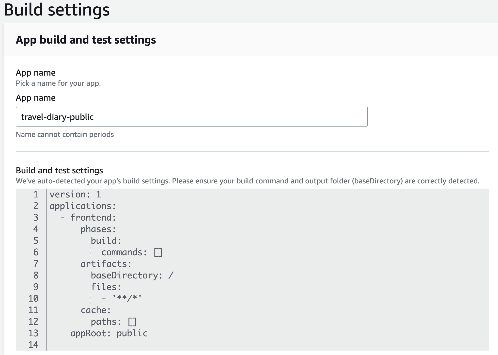

Glad I checked. Looks like there's a `appRoot` value I can set. Sounds straightforward.

Hmmm...spidey sense is tingling...something feels off...

Ah!

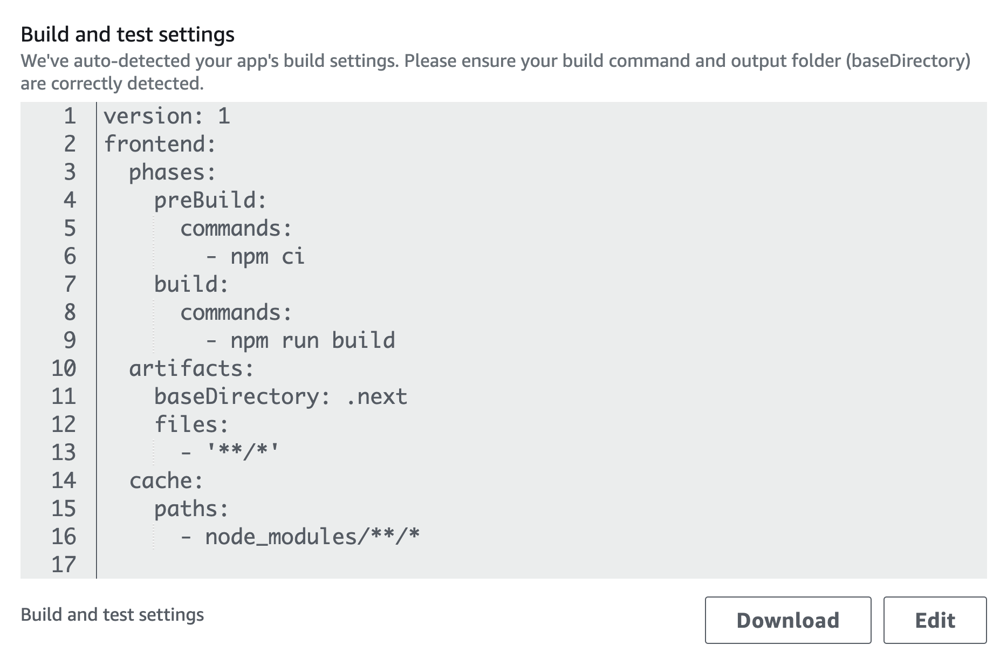

See it? The monorepo buildspec is an array, whereas the normal one is an object.

This is the buildspec I ended up with:

```ts
buildSpec: codebuild.BuildSpec.fromObjectToYaml({
	version: 1,
	applications: [
		{
			frontend: {
				phases: {
					preBuild: {
						commands: ['npm ci'],
					},
					build: {
						commands: ['npm run build'],
					},
				},
				artifacts: {
					baseDirectory: '.next',
					files: ['**/*'],
				},
				cache: {
					paths: ['node_modules/**/*'],
				},
			},
			appRoot: 'frontend',
		},
	],
}),
```

It's at this point I'm second guessing my idea of making this a function and not keeping it as a Stack. My reasoning is that this construct will eventually need enviornment variables set. These variables _depend on_ all the other resources being built.

So it'd be easy to have 1 stack depend on another, than 1 resource depend on all the other resources. Dammit...No worries. let's do this.

<!-- timecheck: 1:12am -->

done :)

<!-- timecheck: 1:20 -->

Then in my `bin/backend.ts` file I added a dependency to make sure the main stack is always deploye first

```ts
const microSaaSStack = new MicroSaaSStack(app, 'MicroSaaSStack', {
	env: { account: context.account, region: context.region },
})

new AmplifyHostingStack(app, 'AmplifyHostingStack', {
	env: { account: context.account, region: context.region },
}).addDependency(
	microSaaSStack,
	'When passing environment variables to Amplify Hosting the primary stack needs to always be deployed first'
)
```

Do I have enought to deploy this and test? I dont' have anything in my main stack but that's ok...

Yolo, let's try it.
Oh wait! I have to update my Github action so that it deploys the Hosting stack too

```yml
- name: cdk deploy
		run: cd backend && npx aws-cdk deploy --exclusively MicroSaaSStack AmplifyHostingStack

```

Looks like it failed due to needing manual approval.

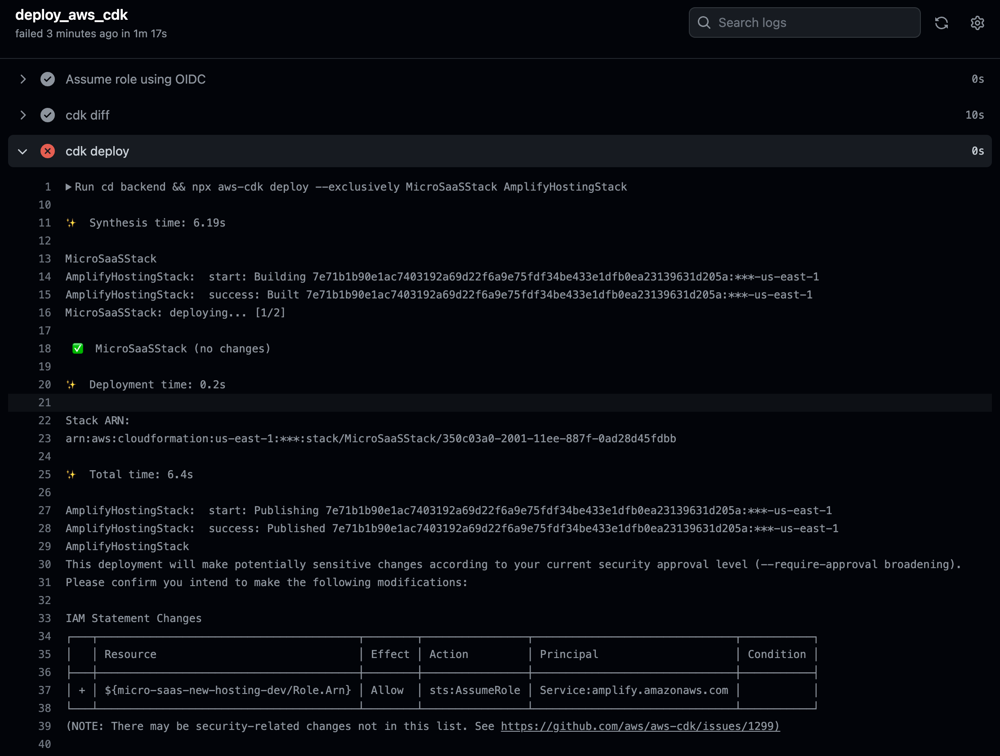

Easy enough, I'll add the `--no-approve` flag. Oh that flag didn't work. Thanks chatGPT, now I have to go look at the docs 😅

Ok cool, it's just `--require-approval LEVEL` where `LEVEL` is an enum.

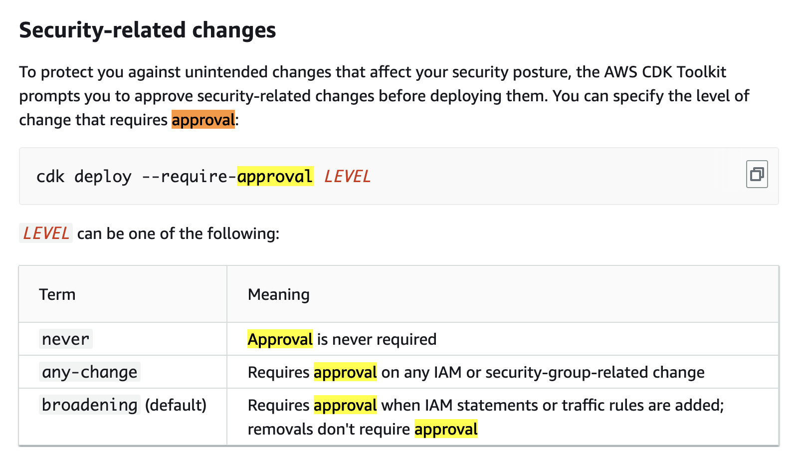

`--require-approval never` is what I want

Succesfully deloyed 🎉

In the Amplify Console I'm going to manually trigger a build and see if I can get the site to deploy.

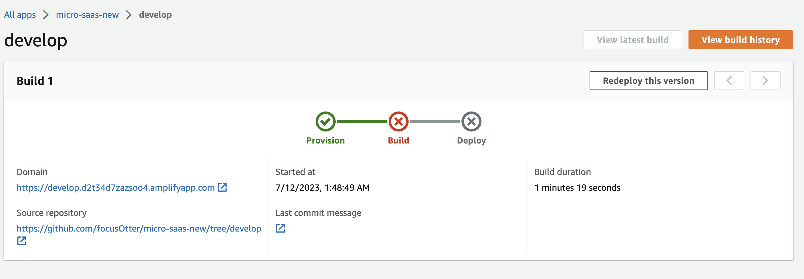

So it didn't work, but there's still some good info here...

- the source repo is set to the correct branch
- the domain is set to the right prefix (`develop`)

Let's look at the build logs..

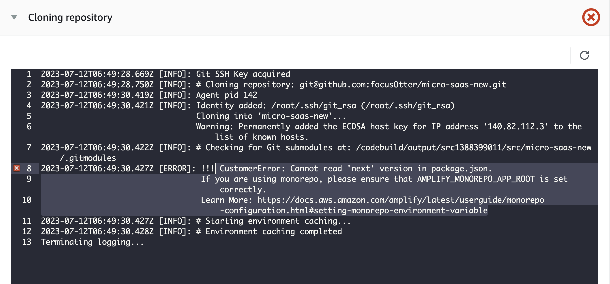

This is actually a pretty good message! Even gives me a [direct link to the docs](https://docs.aws.amazon.com/amplify/latest/userguide/monorepo-configuration.html#setting-monorepo-environment-variable) to fix.

Reading over the docs, it looks like it's a 2 step process:

1. Set the `appRoot`
2. Set an environment variable called `AMPLIFY_MONOREPO_APP_ROOT` that matches the appRoot.

I don't like this. If they have to be the same, then it should just auto-assign it for me.

In any case, let's see if this fixes it. I could just add it in the console, but that's not fun. Let's add it in code.

```ts
// amplify.ts
environmentVariables: {
	AMPLIFY_MONOREPO_APP_ROOT: props.frontendRootFolderName,
	...props.environmentVariables,
},
```

```ts
// frontendHosting/stack.ts
const amplifyApp = createAmplifyHosting(this, {
	appName: context.appName,
	stage: context.stage,
	branch: context.branchName,
	ghOwner: context.github.username,
	repo: context.github.repo,
	ghTokenName: context.github.tokenName,
	frontendRootFolderName: context.frontendRootFolderName, // "frontend"
})
```

I pushed to GitHub which started the deploy.

Deploy successful, but when I went to the Amplify Console, the deploy was already started...this feels off. Shoudln't it only deploy when there is a change to the "frontend" directory?

If this the frontend deploys when there is a change to the entire repo, then my guess is there is a race condition since the frontend is building before the backend has had a chance to update any values.

Time will tell...if this fails, I'll redeploy w/o changing anything since the backend will have deployed by then.

Yup...build failed for the same reason as before. Clicking redeploy.

Build Successful. Damn I'm good.

Ok, a final test is to commit this updated markdown file, which will trigger another backend deploy, but _shouldn't_ trigger a frontend deployment.

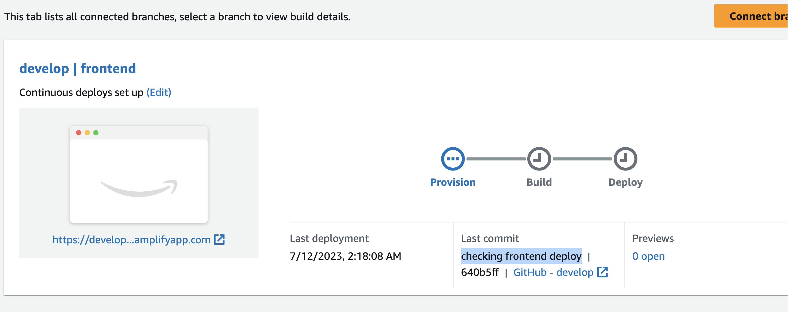

Dang. It still triggered a deployment. _sigh_ to the docs I go.

<!-- timecheck: 2:20am -->

<!-- timecheck: 2:37am -->

Found it...I hope!
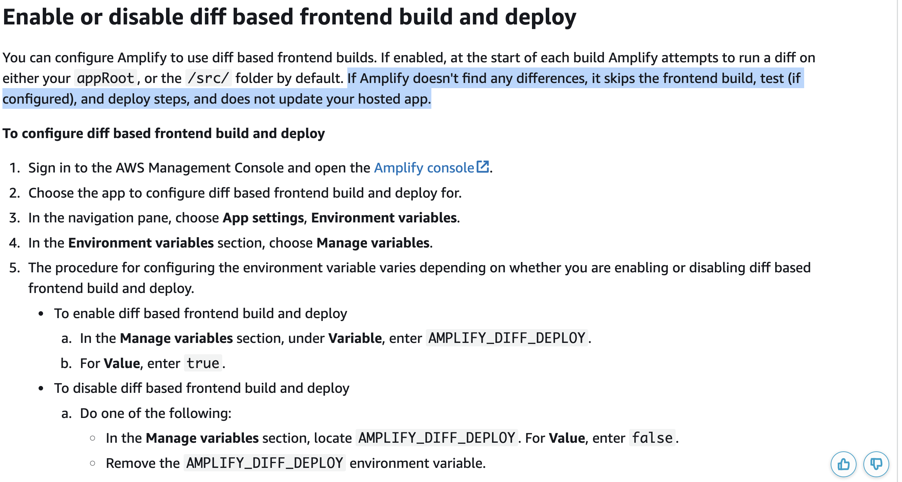

So looks like I just need to add AMPLIFY_DIFF_DEPLOY and set it to true.

I'm going to add this in the console, then add it in code and see if the frontend gets triggered.

It failed...but it did what it was supposed to 🧐

The frontend was skipped, but now the backend was triggered and there is no Amplify backend...so it failed 😮

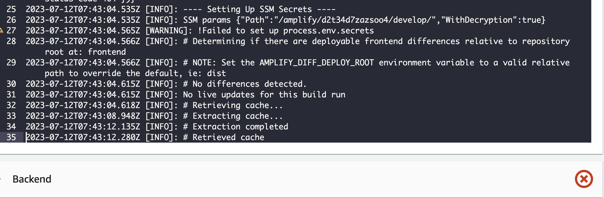

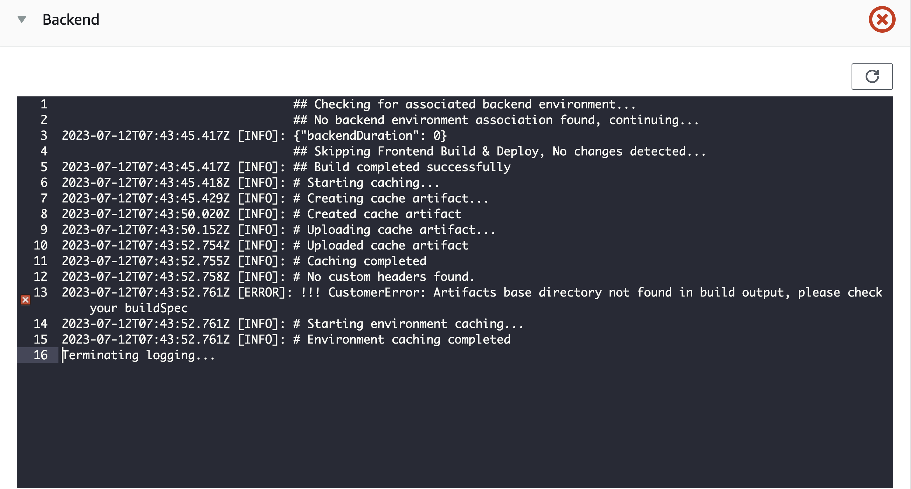

> "No backend environment association found, continuing..."
> ok, but not like that lol

<!-- timecheck: 2:58am -->

I think this is a good spot to call it a night.

Wait...is this just UX thing and it's actually doing what it's supposed to?
Technically, the frontend and backend aren't deploying. It's just that the UI is reporting it as a "failed" build instead of a "skipped" build.

Yea..that makes sense because if I update an environment variable via the CDK, it will update in the AWS Console. I'll report this to the team.

So then what I want to do is keep this as is, but because I still need to trigger a build (so that the frontend environment can get deploy with updated envVars), in my GitHub Action add a step that triggers an Amplify build via a webhook.

I think I have this code somewhere..

[FOUND IT!](https://github.com/mtliendo/cdk-oidc-deploy/blob/develop/.github/workflows/aws.yml#L43-L53) OK, so this is still doable...just not tonight 😅

<!-- timecheck: 3:13am -->
<!-- timecheck: 11:23am -->

## Setting up Amplify Webhooks to Deploy Frontend

Alright, jumping back into this, let's update the GitHub Action so that if grabs the correct webhook URL (depending on the branch) and calls it.

```yml
- name: Trigger Amplify Build
  run: |
    if [ "${{ github.event_name }}" == "push" ] && [ "${{ github.ref }}" == "refs/heads/develop" ]; then
      WEBHOOK_URL="${{ secrets.DEVELOP_WEBHOOK_URL }}"
    elif [ "${{ github.event_name }}" == "pull_request" ] && [ "${{ github.event.pull_request.merged }}" == "true" ]; then
      WEBHOOK_URL="${{ secrets.MAIN_WEBHOOK_URL }}"
    fi

    if [ ! -z "${WEBHOOK_URL}" ]; then
      curl -X POST -d {} "${WEBHOOK_URL}" -H "Content-Type:application/json"
    fi
```

Crazy syntax, but it says:

1. If we're on the develop branch and a push has been made, assign the `DEVELOP_WEBHOOK_URL`.
2. If a PR occurs and is merged assign the `MAIN_WEBHOOK_URL`.
3. If a `WEBHOOK_URL` has been assigned, then call it with `curl`.

So everytime my backend code is updated and pushed to github, the following should occur based off of what I've observed:

1. A github action flow will be triggered
2. At the same time, my amplify frontend deployment will trigger
3. When my stacks deploy, they will build out my frontend
4. My frontend build triggered from Amplify will fail due to not finding a backend.
5. My frontend build triggered from GitHub actions will succeed due to not relying on a backend.

My _feeling_ here is that our monorepo support isn't great. But at the same time everything seems possible. I think a solution is a mix of better documentation, a better Hosting UI, and better mechanisms for fullstack development especially as we lean on the CDK more and more.

## Testing Amplify Webhooks to Deploy Frontend

With my GitHub action updated, I have to create the Webhook in Amplify and assign it as a secret in GitHub.

For creating it, I have two options:

1. Click through the AWS console
2. use the AWS CLI.

Because I'm a glutten for punishment, you know which one I'm picking...

https://awscli.amazonaws.com/v2/documentation/api/latest/reference/amplify/create-webhook.html

Ok, so this doesn't look bad at all.

I'm assuming it's:

```sh
aws amplify
 create-webhook --app-id d2t34d7zazsoo4 --branch-name develop --profile focus-otter-sandbox
```

> I cheat and grap my app id from the console instead of using cfn.output

Worked on the first try 😁

I copied the URL from the terminal output and headed over to GitHub to add the URL.

> I spent 30 seconds googling if there was cool kids way of adding the secret w/o leaving VS Code, but didn't find anything. Probably could do it with the GitHub CLI, but I'm not that cool.

GitHub Repo > Settings > Secrets > Actions> New

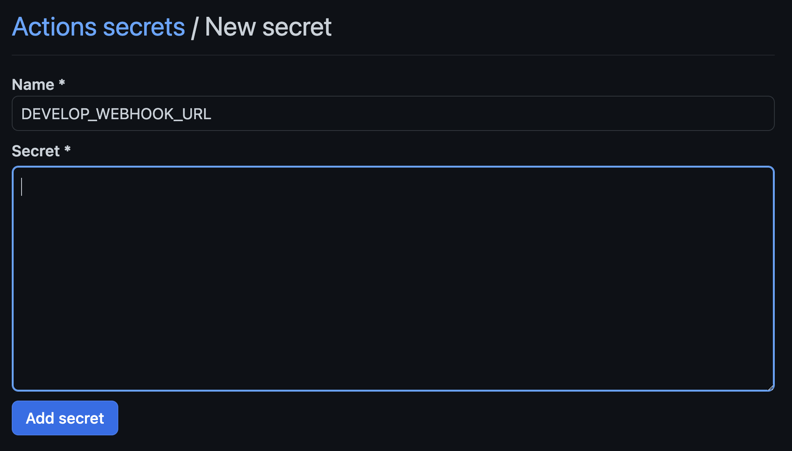

From here I'll push my code and should observe two builds. One failing and one succeeding.

Oh..it failed because it's still has AMPLIFY_DIFF_DEPLOY set to true 😩

I feel like I'm close, but am missing something obvious...obviously hidden.

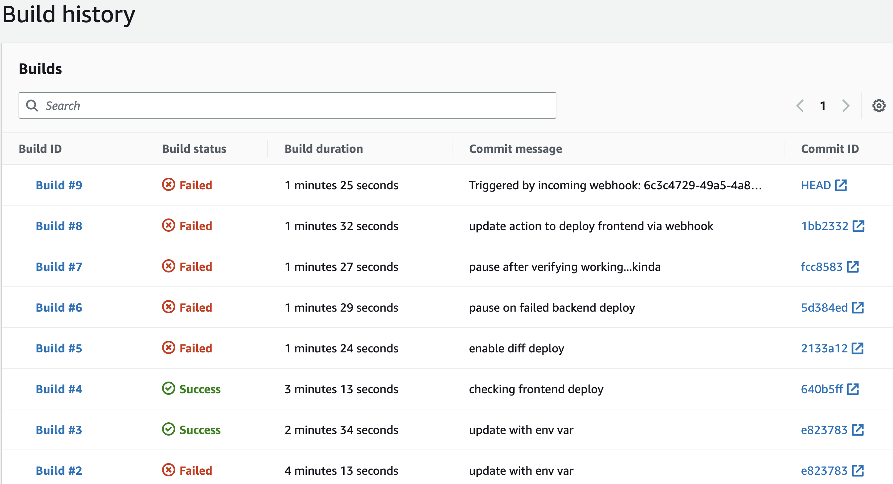

Ok..thinking this through:

The problem is I need to deploy my frontend after every backend build because there may be environment variables that are needed by the frontend's Amplify config that need to be a part of the build.

If I remove `AMPLIFY_DIFF_DEPLOY` then my frontend builds..which is what I want, but it builds **before** my backend has deployed. Which is not what I want.

To solve this, I added `AMPLIFY_DIFF_DEPLOY` and setup a GitHub action to deploy my frontend. But now, Amplify Hosting looks for an Amplify generated backend (`/amplify` folder).

Pausing here since this feels like something I need an Amplify employee to help me out on.

<!-- timecheck: 12:24pm-->
<!-- timecheck: 12:40pm-->

After speaking with Sean Quinn, he recommended putting my backend deployment pipeline in the buildspec instead of using a GitHub action 🤯

I didn't know this was possible. I'd obviously have to update the role for Amplify to allow that, but I just checked and the L2 construct _does_ expose a `role` property. This could significantly decrease ci/cd overhead.

I'm going to refactor this, but there is still a bunch of learnings of things that happened so far, so I'm going to move this over to a `hosting-learnings` branch.

## Migrating from GitHub actions to Buildspec

Ok... I _think_ "all" I have to do is port my cdk operations from my GitHub actions `.yml` file over to my buildspec. Specifically, it'll be in the preBuild phase. Then update The role for Amplify so that it basically has the same permissions as what the cdk has.

I just refactored, which wasn't hard at all. I did have to remove the AMPLIFY_DIFF environment variable since that giving the same issue as before, but I'm completely off GitHub actions!

I deployed and everythign succeeded, but my backend never deployed..

Oh, the buildspec hasn't been updated. Hmmm so similar to the deployment stack where I needed to deploy it first, my `AmplifyHostingStack` stack has to be deployed first. This way the buildspec is updated along with the role. Makes sense.

```sh
npx aws-cdk deploy --exclusively AmplifyHostingStack --profile focus-otter-sandbox
```

After deploying, I verified the buildspec was updated. It is.

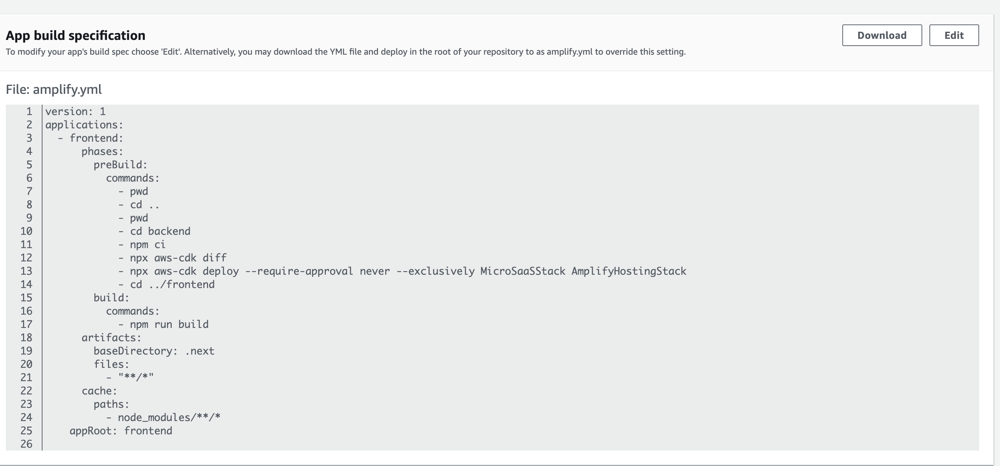

I'm kinda guessing on the file paths part so I put in a couple `pwd` calls so I can debug easier if needed.

Deploying to GitHub.

Alright, the build failed. Not biggy. Let's find out why..

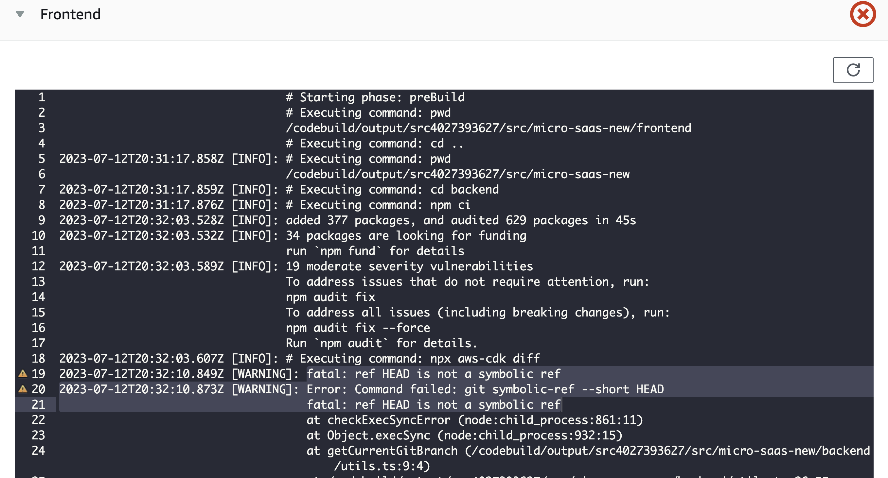

Ah. The same issue with codepipeline 😩 So when Codebuild grabs my code from GitHub, it does it by commit, not branch.

I think I notice something though...to get the branch locally, I run a shell command in my `/utils.ts` file. Amplify knows the branch because it knows where to get the code from. If I can find that variable I should be able to plug it in...

Alright I found AWS_BRANCH [here](https://docs.aws.amazon.com/amplify/latest/userguide/environment-variables.html#frontend-framework-environment-variables)

Going to update my `/utils.ts` file to include the following:

```ts
try {
	currentBranch = childProcess.execSync('$AWS_BRANCH').toString().trim()
} catch (e) {
	console.log(
		'Could not determine current branch from Amplify AWS_BRANCH environment variable'
	)
}
```

Deployed. It Failed. But! I get this error:

```sh
develop: command not found
```

I'm close!!

ChatGPT says I need to use process.env.AWS_BRANCH to avoid it being ran as a command. ohhh...worth noting 😅 This may be why it told me to use `echo` in front, but I ignored it lol

I'm actually going to try `echo` and if that doesn't work I'll go the process.env route.

OMG it worked, I mean, the build failed, but it worked!!!!🎉

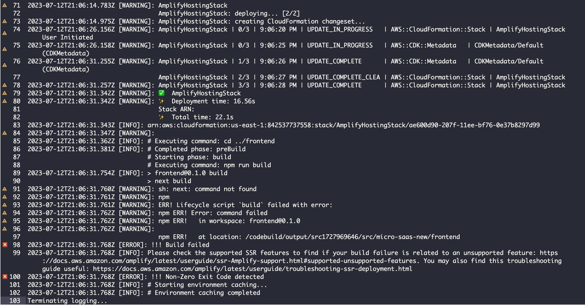

I got the right branch and even deployed my cdk code!

Looks like it failed because it couldn't find the `.next` command. Which suggest all I have to do is run `npm ci` in that directory.

I added it to my buildspec but when the backend deployed it didn't contain my updated buildspec changes until the \*_next_ deploy.

Ah, this is because the buildspec doesn't get updated until the cdk deploys, but at that time the previous buildspec has been acquired and the deployment doesn't self-mutate.

## Fast Forward

Wow, so after a day of talking with Sean and Andy on the Amplify team, the issue seems architectural to Amplify Hosting. In short. This isn't possible.

A summarization of the issue:

**Context**
So essentially, I have a monorepo

```sh
myRepo
  -frontend
  -backend
```

My frontend is a NextJS app and my backend is a CDK app. My backend creates the resources (S3 bucket, Cognito pool, etc) and I pass those ID values to my frontend via a buildspec.yml file.
My buildspec is setup so that a preBuild step deploys my CDK app and the build step handles my frontend. So the order is always `backend deploy > frontend deploy`. Pushing to GitHub triggers this deploy.

**Problem**

If I create a backend resource (say I added an S3 bucket), I need to pass that bucket name to my frontend project via the buildspec file as a new environment variable. However when Amplify Hosting pulls my repo, it is still referencing the old buildspec (because the preBuild step hasn't run yet to update it). This results in the enviornment variable (in this case for the S3 bucket) no being available until the next build.

**What I want**
In one repo, fully deployed with and Amplify buildspec,
I want my frontend to contain a config like shown here: https://github.com/mtliendo/s3-cloudinary-frontend/blob/main/src/config.ts#L1-L18

and I want my backend to pass in values to the frontend build like shown here: https://github.com/mtliendo/s3-cloudinary-backend/blob/9601b9de12fc09bc73e4857e75ba0630709c0dd0/lib/hosting/nextjsHosting.ts#L89-L96

> 🗒️ Honestly, I should be able to add environment variables and they would just be available to my frontend build w/o me having to inject them myself. Like every other hosting provider does.

**Result**
Monorepo support is not possible. Moving to back to separated repos, and my backend with GitHub actions. This is 2 days down the drain.

**Update**
After spitballing solutions with the Amplify team, one said to use the AWS CLI to grab the values from the deployed cloudformation stack:

```sh
export MY_ENV_VAR=$(aws cloudformation --region ap-southeast-2 describe-stacks --stack-name mystack --query 'Stacks[0].Outputs[?OutputKey==`TheOutputName`].OutputValue' --output text)
```

My response was that this solves the problem, but is not a solution.

CDK -> Amplify buildspec -> Cloudformation is not the way I want to explain to customers how easy this is.

But it did get me thinking..

```sh
npx aws-cdk deploy --outputs-file output.json
```

This can be ran locally and in a shell environment. And because this is a monorepo...

```sh
npx aws-cdk deploy --outputs-file ../frontend/output.json
```

No gonna lie. I'm patting myself on the back for this one 😅
