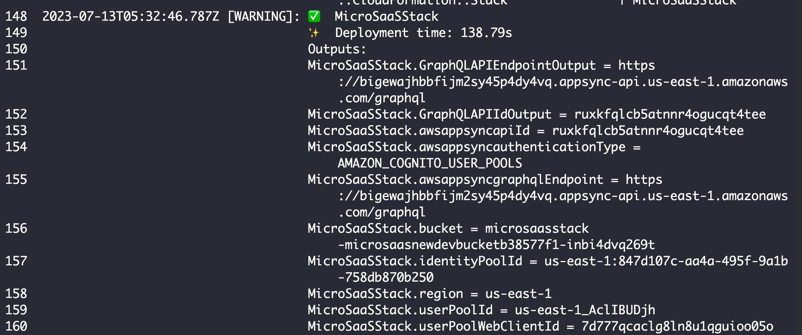

# Fullstack MicroSaaS: Primary Backend Resources Notes

So far I've [setup my ci/cd pipeline](./hosting.md). First time in monorepo and it wasn't as smooth as I hoped, but the outcome is better than I imagined possible.

In this section, we'll actually deploy the resources needed for our frontend. Aside from the L3 construct of the API which I've only done once before, this should be fairly straightforward. This is the architecture we're wanting to create:


To start, as I often do, I'll focus on auth.

## Cognito

I'm just going to pretty much [copy this file](https://github.com/focusOtter/microsaas-backend/blob/main/lib/cognito/auth.ts) and work from there.

Oh cool..no red squiggles, I'll take it!

This creates a userpool, identity pool and webclient. Amplify libraries need all of these values so I'll make sure that when I add these to my stack that I output those values. Before that, I'll take a moment to make sure all the string and `context` values make sense.

Values look good. One thing I noticed is that this setup accepts a `postConfirmation` trigger. This will trigger a Lambda function that stores a user in a database. I'm going to set this prop as optional for now.

I'm getting ready to output the resource names and I'm noticing something:

My `outputs.json` is going to be a flat file, but the Amplify library config expect the following:

```js
{
	aws_project_region: process.env.NEXT_PUBLIC_region,
	Auth: {
		region: process.env.NEXT_PUBLIC_region,
		userPoolId: process.env.NEXT_PUBLIC_userpoolId,
		userPoolWebClientId: process.env.NEXT_PUBLIC_userPoolWebClientId,
		identityPoolId: process.env.NEXT_PUBLIC_identityPoolId,
	},
	Storage: {
		AWSS3: {
			bucket: process.env.NEXT_PUBLIC_bucket,
			region: process.env.NEXT_PUBLIC_region,
		},
	},
	aws_appsync_graphqlEndpoint: process.env.NEXT_PUBLIC_appSyncURL,
	aws_appsync_region: process.env.NEXT_PUBLIC_region,
	aws_appsync_authenticationType: 'AMAZON_COGNITO_USER_POOLS',
}
```

So on the frontend, I'll have to create a config object based off of this. No biggy.

## S3

Next up is S3. This is another boilerplate option.

> 🗒️ It was at this point that I restructured the backend so that `app` directory was gone and each resource was in it's own folder

The bucket is pretty straightforward. It creates a bucket, a Cloudfront distribution and a policy to provide access. I modified this since we don't need a cloudfront distribution--users can only view their own images. This also meant I updated the policy so that signed in users can only view their own files.

A lot of this convention in policy to conform to the Amplify library.

Next up is the API. I'm really, really excited for this.

I deployed the app.

## AppSync API Development with L3 construct

Instead of referencing the [AppSync MicroSaaS API repo](https://github.com/focusOtter/microsaas-backend/blob/main/lib/api/appsync.ts), I'm going to reference my sample L3 repo(https://github.com/mtliendo/l3-trip-logger/blob/main/lib/api/appsync.ts) so I don't get tripped up on small API differences and nuances.

> 🗒️ It's worth noting that creating my AppSync API and writing all of the resolver code in my original MicroSaaS repo amounts to ~510 lines of code (I checked). I'm curious to see what this amount to.

As with the other constructs, I create a `/lib/api/appsync.ts` file, copy over the code I've written before and see what needs to be modified.

Oh weird...I originally had `AmplifyGraphqlApi`, but my editor is upset because it's looking for `AmplifyGraphQlApi`. No worries, easy fix.

Huh..`schema` doesn't accept a string.

_*checks to make sure I'm on the right version*_

😅 0.4.0-agqlac.0 is what I need, I'm on 0.1.0. Probably intentional while not official, but my `package.json` doesn't reflect the latest version. Easy fix though.

```sh
# micro-saas-new/backend
npm i agqlac@0.4.0-agqlac.0
```

Once installed, I reverted to how it was when I first copied the file over. I added a `stage` prop and update my API name accordingly.

I created a `graphql/schema.graphql` file.

Next thing is to call my function in my `lib/stack.ts` file and pass in the props.

```ts
const amplifyGraphQLAPI = createAmplifyGraphqlApi(this, {
	appName: context.appName,
	stage: context.stage,
	userpool: cognito.userPool,
	authenticatedRole: cognito.identityPool.authenticatedRole,
	unauthenticatedRole: cognito.identityPool.unauthenticatedRole,
})
```

This looks really slick. But there's the devil in the details...this doesn't return my AppSync API. I actually have to refer to Rene's example to see how I get this. I'm hoping there's not a multi-deploy step here.

Oh...the package has been updated and has a new namespace 👀

> @aws-amplify/graphql-construct-alpha

Well...as the resident glutten for punishment, let's update to it and see what breaks!

```sh
npm un agqlac@0.4.0-agqlac.0 && npm i @aws-amplify/graphql-construct-alpha
```

```ts
// lib/api/appsync.ts
import { AmplifyGraphqlApi } from '@aws-amplify/graphql-construct-alpha'
```

Nothing broke :) Looking at his diff, it's just an NPM location change.

I'm reading over the intellisence docs on `AmplifyGraphqlAPI` and it says the following:


Note the actual API contract to enable xray is:

```ts
api.resources.cfnGraphqlApi.xrayEnabled = true
```

Ok, so I need the L2 construct because...what? The only value Amplify cares for me to derive is the AppSync URL...can I get away with not dropping down? Let's see...

### SaaS Schema Creation

My [current SaaS schema](https://github.com/focusOtter/microsaas-backend/blob/main/lib/api/graphql/schema.graphql) is 76 lines of code and doesn't have filter, subscriptions and other features.

This one...

37 lines of code and a lot more **useful** code is going to be generated.

And regarding the ability to output values needed for Amplify w/o using the L2 construct:

```ts
new cdk.CfnOutput(this, 'aws_appsync_graphqlEndpoint', {
	value: amplifyGraphQLAPI.resources.cfnGraphqlApi.attrGraphQlUrl,
})
new cdk.CfnOutput(this, 'aws_appsync_authenticationType', {
	value: 'AMAZON_COGNITO_USER_POOLS',
})
```

In my MicroSaaS repo I created before, the resolvers are all CRUD operations. Every single one of them. It equates to ~240 lines of code.

In that same repo, I wrote my own pipeline resolvers and their accompanying functions. This was ~180 lines of code.

This construct brought both to zero. What can't be quantified is the mental overhead--I'm back to focusing on my product. Creating an API is now as easy as creating all the other types of resources in this directory.

Gonna deploy...



This is the promise I wanted to fulfill to my MicroSaaS community. I'm not shy on leaving _actionable_ feedback. But up to this point, everything is great!

## Accessing Generated Resources

Based off of my [current MicroSaaS implementation](https://github.com/focusOtter/microsaas-backend/tree/main/lib/functions) I have 3 more resources to deploy:

1. **`postConfirmation`** trigger: When a user signs up, they are added to a `User` table. This table is generated by the L3 construct.
2. **`getRecipeIdea`**: AppSync calls out to OpenAI via a Lambda function. I have two options here: Either attach a lambda function to AppSync (what I'm do today), or use an HTTP resolver, written in TypeScript.
3. **Stripe Webhook**: A Lambda function that Stripe calls when an event occurs (payment succeed, status change, etc.).

All of these functions need a table ARN and/or table name, 2 of them need secrets from Secrets Manager/Parameter Store.

To be continued...
