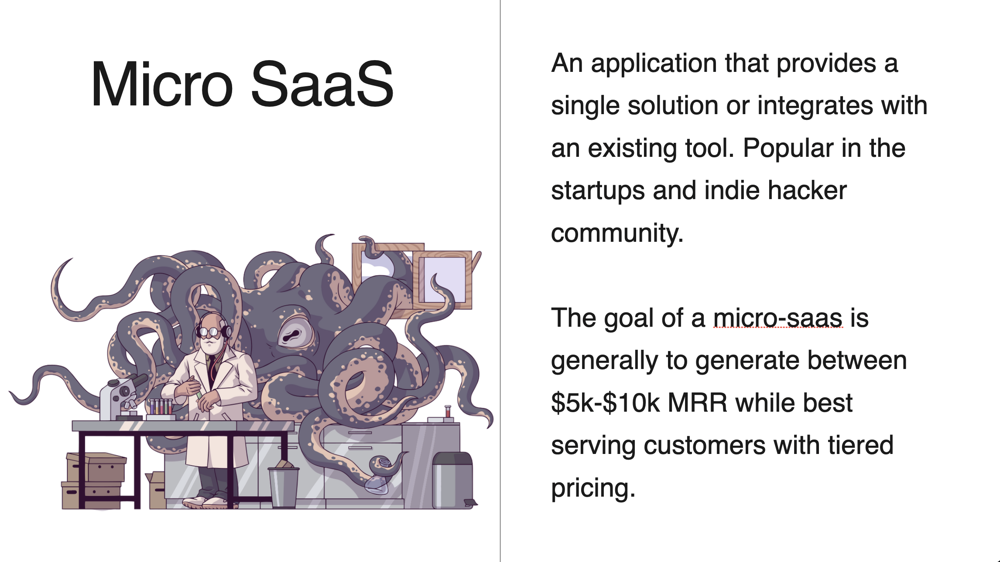

# Fullstack MicroSaaS (New)

I've spent the last year speaking with builders, hackers, and founders, while also creating content around a MicroSaaS development. I've spoken around the world on the matter, and have formed a solid opinion on how to build one on AWS.



<!--  -->

Implementation is different from theory however. So while I can create a CDK template for folks to get started, they still have to understand what is happening since they'll be owning it. In addition, giving them a product (`Recipe`), and telling them to modify it to their own product is tough since there are hundreds of lines of resolver code they'd have to tweak.

Even moreso, these operations are all simple CRUDL operations. Nothing too crazy, but there's a lot of it.

Then along came the L3 construct from Amplify. I've been playing with this and feel it could be the answer if given the right investment.

This project will be used to evaluate that idea.

In this file, you'll find after-the-fact steps taken to create the project structure. In `backend/notes/index.md` you'll find real-time steps taken to create the necessary backend infrastructure.

The frontend will be a migration from NextJS file-based routing, to the newer app router. Not sure at this time when/how this will be done.

## Project Overview

The persona of an AWS MicroSaaS developer is one that is knowledgeable in the cloud, but still prefers to move quickly. As such, this repo showcases a single-account/multi-region approach to building.

Using Github Actions, when a commit is made to the `develop` branch, a `dev` backend environment **and** frontend hosting environment is deployed in one region.

When a commit is made to the `main` branch, a `prod` backend environment **and** frontend hosting environment is deployed in **another** region, but in the same account.

No AWS secrets are stored in the GitHub action. Instead a role is deployed in the target account that grants GitHub temporary permissions perform actions on a given repo. This will be explained further in a subsequent section.

## Workspace Setup

This project is a monorepo. The frontend is a NextJS application while the backend uses CDKv2. To accomplish this, I setup an NPM workspace. Here's how I did it:

To get started I performed the following steps:

```sh
md micro-saas-new && cd $_ && npm init -y && git init
```

The above will create the project, change into it and initialize it with git and npm.

Before adding packages, I created a `.gitignore` file:

```sh
touch .gitignore && echo "node_modules/" >> .gitignore
```

At this point, I opened up the project in VS Code.

In my `package.json` file, I tell NPM that this is a workspace by adding the following fields:

```json
"private": true,
"workspaces": [
  "frontend",
  "backend"
],
```

The above configuration tells NPM to not publish this repo as an NPM package, and that the nested directories `frontend` and `backend` are part of this workspace.

These directories don't exist yet, so I created them next.

For the frontend, I performed the following from my root project directory:

1. Create the nested frontend folder and change into it: `md frontend && cd $_`
2. Initialize it with NextJS: `npx create-next-app@latest ./`
   > 🗒️ Because this is workspace, node_modules will be installed in the root of our project.
3. Accept all defaults (tailwind, no source directory, use app-router, etc) during the NextJS installation.
4. Change back to the project root: `cd ..`

For the backend, I performed similar steps:

1. Create the nested backend folder and change into it: `md backend && cd $_`
2. Intialize it with the AWS CDK (using TypeScript): `npx aws-cdk init -l typescript`
   > 🗒️ I already have a bootstrapped CDK environment and account credentials
3. Change back to the project root: `cd ..`

---

At this point my workspace was setup, but as an additional setup, I prefer to get a CI/CD pipeline working. However, do so required me to deploy some AWS resources.

So join me [on the backend](../backend/notes/index.md)
